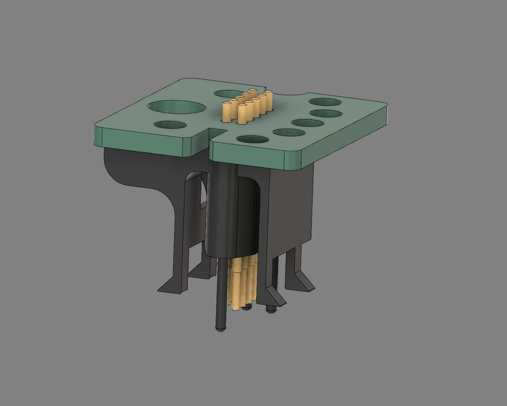

# DIY TagConnect TC2050

> This is a work in progress - I will update this repo once I receive my PCB and test the first connector. It is possible that I have to change some stuff.

Want to use the TagConnect connector for flashing and debugging on your PCB, but don't have a TC2050 cable, nor a compatible debug device (like a JLink)? 

That's exactly the issue I ran into. Therefore I designed a connector usable with the TagConnect TC2050 footprint. (I plan to use this connector with a Pico flasher.)

## How it works

The 10 pogo-pins are soldered onto a tiny PCB. The larger holes are for soldering the cables of your debug device onto the PCB.

The 3D printed housing acts as a guide for the pogo pins and inserts into the target PCB's TC2050 footprint, just like the real connector.

## Requirements

- a 3D printer for printing the housing (`3D-Model/DIYTC2050_Housing.stl`) and the soldering spacer (`3D-Model/DIYTC2050_SolderingSpacer.stl`)
- the PCB breakout board (gerber for JLCPCB in `Gerber/DIYTC2050.zip` - KiCad files in `DIYTC2050/`)
- 10x P50-B1 pogo pins (0.68mm diameter, 16mm length) ([Amazon](https://amzn.eu/d/0aM7f1Ir))
- a threaded insert + screw for screwing the PCB onto the connector housing (M4 recommended)

## Assembly

1. Insert the pogo pins (with the spring part facing down) into the soldering spacer
2. Put the PCB onto the soldering spacer and solder the pins to the pcb
3. Solder your debug wires to the PCB
4. Insert the threaded insert into the connector housing
5. Screw the PCB onto the housing

## Notes
- the screw connection from PCB to housing is not great, but I will try it like this for
- the PCB only supports the SWD pinout - i may add a JTAG version (or combine both) in the future
- the schematic and footprint for the TC2050 (with correct pinout) can be found in `Symbols/TC2050/`

